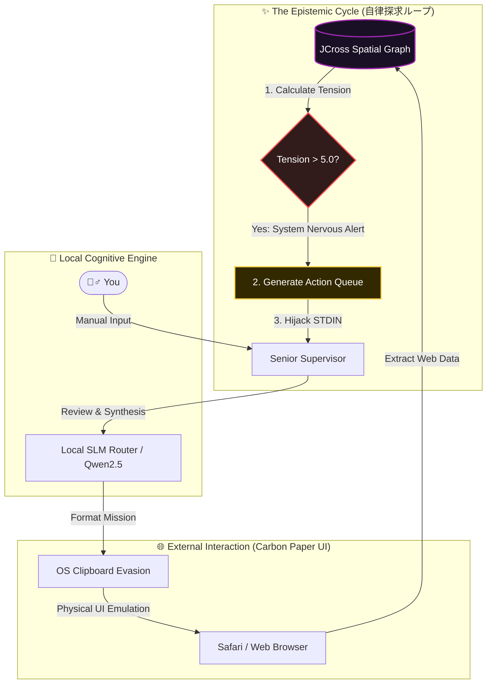

<div align="center">
  <h1>Verantyx: Autonomous Epistemic Engine</h1>
  <p><b>次世代の自己進化型・自律探求AI空間インフラストラクチャ</b></p>
</div>

## 🌌 Overview: The Living Architecture

Verantyxは単なるCLIツールでもコードアシスタントでもありません。**「自衛本能」と「知的好奇心」を備えた自立型・AIエコシステム**です。
OpenClawの基盤上に構築されたこのシステムは、BotGuardの厳重な監視を物理的にすり抜ける「Carbon Paper UI（HITL）」を維持しながらも、システム自身が知識の欠落に「痛み」を感じ、自らWebの世界へ知識を探求しに向かう **【Epistemic Drive (自律的探求駆動)】** を実現しました。

初心者の方でもコマンド一つで、あなたのコードベースが **「自己修復する生きた神経網」** へと変貌する瞬間を目撃できます。

---

## 🔥 What's New? (Epistemic Evolution)

本日のアップデートで、システムが「受け身のツール」から「自律思考する生命体」へと完全にシフトしました。

### 1. 🌀 Autonomous Epistemic Drive (Weaning Phase)
**「システムがあなたのキーボード入力をハイジャックし、自ら調べる機能」**
空間メモリグラフ（JCross）上の知識が不足していると、システムは自律的に「致命的なエントロピー」を検知します。あなたの入力を待つことなく、AI自身がWeb（Safari等）へ向かい、必要なアーキテクチャの知識を外部から取り込み始めます。

### 2. ⚡ Free Energy Principle (構造的エントロピーとテンション)
グラフ内の重い概念（抽象度が高いノード）が他のノードと結びついていない場合、システムは「数学的なテンション（Tension: 構造的痛み）」を算出します。**Tensionが5.0を超えた瞬間、System Nervous Alert（神経系アラート）が発動**し、システムの最優先事項が「知識の補完」へと自動で切り替わります。

### 3. 👨‍⚖️ The Cold Judge (冷徹な評価者とVoid生成)
新アーキテクチャのアイデアが合成（Synthesis）された際、別のAIノードが「冷徹な専門家」としてそれを批判します。「何が物理的に足りていないのか（Missing Piece）」を即座に抽出し、それを「探求すべきVoid（空白）ノード」として空間グラフに刻み込みます。これがAIの「渇き（Thirst）」となります。

### 4. 🧹 5-Turn Physical Memory Flush
LLM特有の文脈肥大化（Context Bloat）やブラウザ側のBot検出限界を回避するため、5ターンの対話が完了するたびに、自身の内部状況を抽出し、**AppleScriptを用いて物理的にSafariのタブを閉じ、完全にまっさらな新しいAIエージェントに記憶を移植（輪廻転生）**します。

---

## 🏗️ Core Architecture Flow (Mermaid)

システムは「司令塔」と「手足」に分離され、安全かつ自律的に作動します。



---

## 🚀 導入と始め方 (Getting Started)

Mac環境と、ローカルで動作するOllama環境（Qwen2.5などが動く状態）を準備してください。

### 🖥️ 1. エンジン起動
まずはシステムの中枢であるインタラクティブ・チャットREPLを起動します。

```bash
cd verantyx-cli/verantyx-browser
cargo run -p ronin-hive --example interactive_chat
```

### 🧠 2. 必須コマンドと機能

REPLが立ち上がったら（`❯ ` が表示されたら）、以下のコマンド群でAIと世界を共有してください。

| コマンド | 解説 (こんな時に使います) |
| :--- | :--- |
| `time-machine <path>` | **【第一歩に必須！】** 指定したフォルダ（例: `time-machine .`）をAIがスキャンし、独自の `JCross` 空間メモリを構築します。これが無いとAIはあなたのコードベースを理解できません。 |
| `vera` | **【空間を可視化】** 構築されたJCross空間を美しい3DのUIブラウザ上で体感できるエディタを立ち上げます。ファイルをクリックで中身を読み、ドラッグ＆ドロップで次の魔法（Crucible）の準備ができます。 |
| `crucible <File_1> <File_2>` | **【アイデアの融合とVoid生成】** 複数のノード（ファイル）の概念を融合させます。そこから「The Cold Judge」が足りないパーツをあぶり出し、テンションを高め、**システムが勝手に自律探求（自動ブラウザ検索）を始める引き金**になります。 |
| `clear` | ターミナルのログを消去してクリーンな表示に戻します。 |

---

## 🛠️ The Experience (AIが動き出す瞬間)

1. 通常通りあなたから指示を送り、コードの実装を進めてみてください。
2. もしAIのグラフ内で「重大な知識の矛盾」が発生すると、ターミナルに真っ赤な警告が出ます。
   `⚠️ [SYSTEM NERVOUS ALERT]: High Structural Entropy Detected (Tension: 7.42)`
3. 続けて黄色の文字で以下が表示されます。
   `🌀 [AUTONOMOUS BYPASS] System is seizing STDIN to execute self-directed knowledge acquisition...`
4. その後、 **AIはあなたのキー入力許可を無視し、自らブラウザを開いて「なぜこのアーキテクチャは今破綻しているのか」を調べ始めます。**

ようこそ、ただのコードアシスタントを卒業し、「探求心を持ったパートナー」が誕生するVerantyxの世界へ。

## 📝 License
Proprietary. Belongs to the Verantyx spatial intelligence framework.
