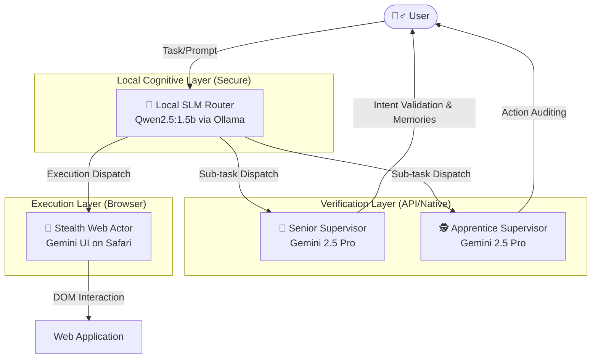

<div align="center">
  <h1>Verantyx: 4-Node Agentic Hierarchy & Carbon Paper UI</h1>
  <p><b>A highly resilient, Human-in-The-Loop Autonomous Agent System built on top of OpenClaw infrastructure.</b></p>
</div>

## 🌐 Overview

The **Verantyx Browser** subsystem introduces a revolutionary 4-node agentic architecture designed to bypass modern BotGuard and CAPTCHA mechanisms (like those aggressively employed by platforms such as Google Gemini & Claude) while maintaining robust, long-term memory and autonomous task execution capabilities. 

By combining local Small Language Models (SLMs) with a robust "Supervisor/Worker" hierarchy, Verantyx acts as a sentient spatial router. Crucially, we enforce a **Carbon Paper UI (Human-in-The-Loop)** mechanism to manually mediate clipboard interactions, definitively solving the bot-detection crisis.

## 🏗️ The 4-Node Hierarchical Architecture

The system is split into four distinct cognitive nodes, completely isolating planning logic from raw web execution.



### 1. The Local Planner (SLM: Qwen2.5)
The brain of the operation runs on local hardware using `Ollama`. It maintains long-term memory, parses user intent, avoids context dilution, and breaks down complex prompts into specific sub-tasks to be dispatched to the remote models. It serves as an impermeable wall protecting the core agent logic from the massive context window destruction prevalent in long-running cloud instances.

### 2. Senior Supervisor (Gemini via API)
The Senior Supervisor receives payloads from the SLM, analyzing them to ensure the output aligns exactly with what the User intended. It injects additional memory and refines prompts without actually executing them on the target machine.

### 3. Apprentice Supervisor (Gemini via API)
The Apprentice operates on a 5-turn promotion cycle, shadowing the Senior and ensuring spatial state is synced accurately within the `.ronin/experience.jcross` database.

### 4. Stealth Worker (Gemini UI on Safari)
The "Hands and Feet". This node controls the actual Web UI. Because BotGuard instantly detects headless Chrome automation, puppeteer, or injected JavaScript events, the Worker operates **entirely via human-mediated native OS actions**.

---

## 🛡️ Carbon Paper UI (BotGuard Evasion & HITL)

To defeat advanced anti-bot systems, we implemented the **Carbon Paper UI**—a secure "Human-in-The-Loop" (HITL) manual handoff protocol.

Instead of writing scripts to click buttons (which are instantly blocked), the system automatically formats the perfectly optimized prompt and securely injects it into the macOS Clipboard. It then prompts the user via a terminal Dialoguer.

### Operational Flow

1. **Prompt Generation:** SLM + Supervisors construct the optimal prompt.
2. **Clipboard Hydration:** The OS Clipboard is silently loaded via `arboard`.
3. **Target Acquisition:** The user is prompted in the CLI:
   ```text
   👉 クリップボードの準備が完了しました。送信先のブラウザを開きますか？
   > Safariを開いて貼り付ける (Cmd+V)
     再度クリップボードにコピーする
   ```
4. **Symbiotic Switch:** The system programmatically brings `Safari` to the foreground via macOS Native APIs.
5. **Human Actuation:** The user presses `Cmd+V + Enter`. This completely circumvents BotGuard since the keystrokes are registered natively by the human OS interaction.
6. **Tamper Verification:** The agent polls the DOM post-submission to verify that the pasted content exactly matches what the agent loaded into the clipboard (protecting against clipboard hijacking).

## 🚀 Getting Started

Ensure you have `Ollama` running with the `qwen2.5:1.5b` model actively loaded.

```bash
cd verantyx-cli/verantyx-browser
cargo run -p ronin-hive --example interactive_chat
```

### Important Fixes (Version 1.2+)
- **Multi-byte Panic Elimination:** Japanese character boundary index panics `[0..80]` have been comprehensively replaced with safe `.chars().take(N)` iterators across all nodes.
- **Stdin Buffer Corruption:** Replaced dangerous `read_line()` multi-line pasting with robust `dialoguer::Select` validation to prevent REPL ingestion bleed-over. 

## 📝 License
Proprietary. Belongs to the Verantyx spatial intelligence framework.
